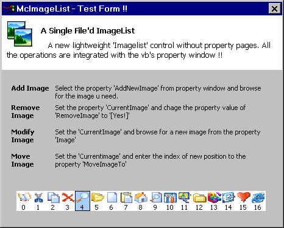



## McImageList 1\.4 \- \[ A single file'd Lightweight ImageList Control \]

### Description

This is a single file'd 'ImageList' control. It does not uses a property page to

add/delete/modify/list images. All the operations can be done right from the

vb's property window. Very simple to use control with the least possible

file size and gives better scence and appearance!! Check this out!, and please

give me Feedback. Jim Jose :-))
 
### More Info
 

             |
---                |---
**Submitted On**   |2005-07-20 02:19:02
**By**             |[JJJJJJJJ](https://github.com/Planet-Source-Code/PSCIndex/blob/master/ByAuthor/jjjjjjjj.md)
**Level**          |Intermediate
**User Rating**    |5.0 (75 globes from 15 users)
**Compatibility**  |VB 6\.0
**Category**       |[Custom Controls/ Forms/  Menus](https://github.com/Planet-Source-Code/PSCIndex/blob/master/ByCategory/custom-controls-forms-menus__1-4.md)
**World**          |[Visual Basic](https://github.com/Planet-Source-Code/PSCIndex/blob/master/ByWorld/visual-basic.md)
**Archive File**   |[McImageLis193109992005\.zip](https://github.com/Planet-Source-Code/jjjjjjjj-mcimagelist-1-4-a-single-file-d-lightweight-imagelist-control__1-62417/archive/master.zip)

